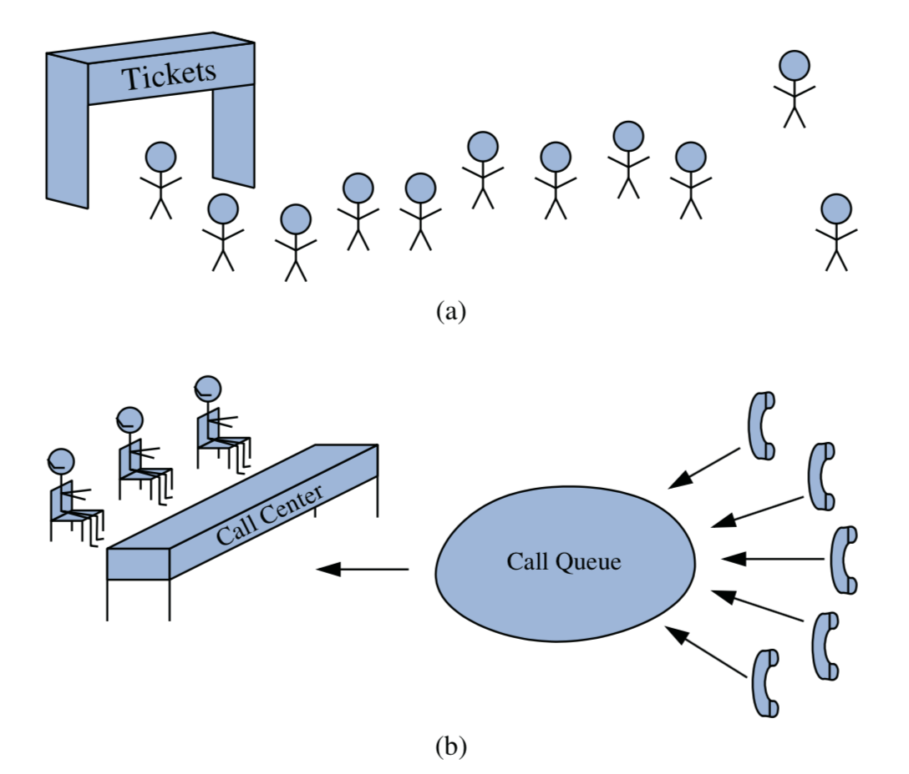

# Queue
- 
- Queue는 FIFO(First-In, First-Out) 방식으로 삽입되고 제거되는 자료구조이다.
- 놀이공원에서 줄을서거나, 콜센터에서 전화를 받는 방식이 이와 비슷하다.
- ADT(Abstract Data Type)
  - enqueue(e): Queue의 맨 뒤에 Element를 추가한다.
  - dequeue(): Queue의 맨 앞에있는 Element를 제거하면서 해당 값을 return한다. (Queue가 비어있으면 null을 return)
  - first(): Queue의 첫번째 Element를 return한다.
  - size(): Queue에 있는 Element 개수를 return한다.
  - isEmpty(): Queue가 비어있는지 확인한다. (Boolean)

## Array로 구현한 Queue
- Array로 Queue의 enqueue와 dequeue를 구현할 때 쉽게 생각할 수 있는 방법으로는
  - enqueue: array의 index를 1씩 늘려가며 추가
  - dequeue: dequeue시마다 array[0]를 return, remove해주며 data들을 왼쪽으로 한칸씩 shift
  - enqueue는 문제가 없지만 dequeue마다 모든 element의 이동이 필요하므로 `O(n)`의 시간 복잡도를 가진다.
  - 개선 할 수 없을까?
- 그럼 element를 shift하지 않고 queue의 first element에 해당하는 index를 따로 저장하자
  - enqueue: 아까와 동일
  - dequeue: first element의 index를 알고 있으므로 `O(1)`의 시간 복잡도를 가진다.
  - 문제점이 또 하나 있다. Array는 capacity가 정해져 있으므로 enqueue와 dequeue가 반복될 수록
    사용할 수 있는 공간이 점점 줄어든다. (enqueue 할 때 index를 늘리기만 하므로)
  - ![enqueue 한계][./queue-data.png]
- 그럼 enqeue또한 바꿔보자
  - Array를 circular하게 이용하기
  - Array가 가득차면 다시 Array의 첫 index부터 enqueue를 한다.
  - first element의 index를 따로 저장하고 있으니 어떤 element가 첫번째인지 햇갈릴 일은 없다.
``` java
public class ArrayQueue<E> implements Queue<E> {
    public static final int CAPACITY = 1000;
    private E[] data;
    private int f = 0;
    private int sz = 0;

    public ArrayQueue() {this(CAPACITY);}
    public ArratQueue(int capacity) {
        data = (E[]) new Object[capacity];
    }

    public int size() { return sz; }
    public boolean isEmpty() { return (sz == 0); }

    public void enqueue(E e) throws IllegalStateException {// Time Comlexity O(1)
        if (sz === data.length) throw new IllegalStateException("Queue is full");
        int avail = (f + sz) % data.length;
        data[avail] = e;
        sz++;
    }

    public E first() {
        if (isEmpty()) return null;
        return data[f];
    }

    public E dequeue() {// Time Comlexity O(1)
        if (isEmpty()) return null;
        E answer = data[f];
        data[f] = null;
        f = (f + 1) % data.length;
        sz--;
        return answer;
    }
}
```

## Linked-List로 구현한 Queue
``` java
public class LinkedQueue<E> implements Queue<E> {
    private SinglyLinkedList<E> list = new SinglyLinkedList<>();
    public LinkedQueue() {}
    public int size() { return list.size(); }
    public boolean isEmpty() { return list.isEmpty(); }
    public void enqueue(E element) { list.addLast(element); }
    public E first() { return list.first(); }
    public E dequeue() { return list.removeFirst(); }
}
```

## Deque (Double-Ended Queue)
- 
- 일반적인 Queue와는 다르게 맨 앞과 맨 뒤에서 모두 삽입과 제거가 가능한 자료구조
- ADT(Abstract Data Type)
  - addFirst(e): Deque의 맨 앞에 Element 추가
  - addLast(e): Deque의 맨 뒤에 Element 추가
  - removeFirst(): Deque의 첫번째 Element 제거 및 return
  - removeLast(): Deque의 마지막 Element 제거 및 return
  - first(): Deque의 첫번째 Element return
  - last(): Deque의 마지막 Element return
  - size(): Deque의 Element 개수를 return
  - isEmpty(): Deque가 비었는지 확인
