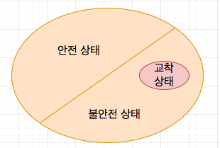

# 교착 상태(DeadLock)
- 자원이 한정적인 상황에서 두 개 이상의 프로세스가 각자 먼저 확보한 자원을 가진 채 상대방의 자원을 필요로 할 경우,
  외부로부터의 조치가 없는 한 이들은 아무 일도 못하고 계속 기다려야 할 것이고 이를 `교착 상태(DeadLock)`이라고 한다.
- 교착 상태의 문제점
  1. 해당 프로세스들이 더 이상 실행되지 못하여 사용자들에게 응답해주지 못함
  2. 보유된 자원들이 교착 상태에 벗어나기 전까진 전혀 활용되지 못한다.

## 자원이란?
- 물리적인 분류
  1. 하드웨어 자원: 눈으로 보고 만질 수 있는 모든 자원(하드디스크, 메모리)
  2. 소프트웨어 자원: 데이터, 메시지 등
- 선점 가능성으로 분류
  1. 선점 가능(preemptible) 자원: CPU, 메모리처럼 한 프로세스에 의해 사용도중 선점되어 다른 프로세스에게 할당(Allocation)해 주었다가
     다시 원래 프로세스에게 돌려주어도 되는 자원
  2. 선점 불가능(Nonpreemptible) 자원: 선점이 될 경우 자원을 빼앗긴 프로세스는 정상적인 진행을 포기해야하는 불이익을 받게되는 자원
- 사용되는 방식에 따른 분류
  1. 공유 가능(sharable) 자원: 한 프로세스에 할당된 자원을 동시에 다른 프로세스가 할당받아 같이 사용가능
  2. 배타적 사용(Exclusive Use) 자원: 공유가능하지 않은 자원(CPU, 메모리, 테이프, 버퍼, 키보드, 모니터)
- 재사용 가능 여부에 따른 분류
  1. 순차적 재사용 가능(Serially Reusable) 자원: 먼저 할당된 자원이 사용 후 반납(Release)되었을 때 자원 자체는 계속 존재하여 또다른 프로세스에 할당 가능한 자원 (CPU, 메모리, 테이프, 하드디스크, 버퍼, 프로그램)
  2. 소모성(Consumable) 자원: 사용 후 사라지는 자원 (signal, message)

## 프로세스가 자원에 취할 수 있는 행동
1. 필요한 자원에 대한 요청
  - 요청된 자원이 사용가능시 할당 받는다.
  - 사용 중인 자원에 요청시 해당 자원이 반납될 때까지 대기한다.
2. 사용이 끝난 자원 반납
  - System call로 자원을 반납한다.

## 교착 상태의 원인은?
- 아래 4가지 원인을 모두 가지고 있어야만 데드락에 빠진다.
- 한 개라도 해당시 데드락에 빠지지 않음.

1. 자원의 배타적인 사용(Mutual Exclusion Condition)
2. 자원의 부분 할당(Hold & Wait Condition)
  - 프로세스가 필요한 자원을 확보해나가다 이미 확보된 자원을 지닌채 대기에 빠짐
3. 자원의 선점 불가능성(Nonpreemptive Condition)
  - 자원의 선점 불가능성을 고수 할 경우 데드락에 빠질 수 있음
4. 자원에 대한 순환 대기

## 교착 상태 해결 방
1. 예방: 교착 상태를 아예 발생하지 않도록 함
2. 회피: 교착 상태를 피하도록 함
3. 복구: 교착 상태에 빠지도록 두었다가 후에 조치

### 예방 기법
- 교착 상태가 아예 발상해지 않도록 할 수 있으나 자원낭비와 특정 프로세스의 무한 대기 가능성이 있다.
1. 자원의 배타적 사용 조건을 배제한다.
  - 모든 자원을 공유자원으로 두어 교착 상태 발생을 차단
  - 공유 가능한 자원이 될 수 없는 자원(프린트, 테이프 장치 등)이 있어 `실현 불가능`
2. 자원의 부분 할당을 배제
  - 부분 할당을 없애겠다 -> 모두 한번에 할당하겠다.
  - 즉 프로세스들이 자신이 필요한 모든 자원을 미리 할당 받아 실행한다.
  - 자원 낭비 및 무한 대기를 일으킬 수 있다.
3. 자원의 선점 불가능을 배제
  - 모든 자원이 선점 가능하도록 한다.
  - 어떤 프로세스는 계속 일을 마치지 못하고 선점당해 무한대기에 빠질 수 있다.
4. 자원의 환형 대기 상황을 배제
  - 자원 확보에 순서를 정하여 교착상태 예방
  - 자원 낭비 및 무한 대기 상태가 일어날 수 있음

### 회피 기법
- 교착 상태로 가는 것을 막겠다는 점에서 예방과 다를 바 없지만 발생조건을 배제하는 방식이 아닌 다른 알고리즘을 이용하는 기법이다.
- 안전 상태: 모든 프로세스가 유한(Finite) 시간 내에 정상 종료될 수 있는 상태, 교착 상태가 발생할 수 없는 상태
- 불안전(Unsafe) 상태: 안전 상태가 아닌 경우, 교착 상태로 갈 가능성이 있고 그럴경우 방지책이 없다.
- 즉 회피 기법이란 시스템이 안정 상태로만 가도록 지속적으로 제어해 나가는 것을 의미한다.
- 

#### Dijkstra의 은행가 Algorithm
- 프로세스가 자원을 요구할 때 시스템이 자원을 할당한 후 안정 상태로 남아있는지 사전에 검사하여 교착상태를 회피하는 방법
- 은행가 알고리즘이 제대로 동작하기위한 가정
  - 시스템 내의 프로세스 수가 고정되어 있어야 함 `(현실적으로 힘듦)`
  - 자원의 수 역시 고정되어 있어야 함 `(현실적으로 힘듦)`
  - 각 프로세스가 요구할 자원의 최대 개수가 알려져 있어야 함 `(현실적으로 힘듦)`
  - 각 프로세스는 할당 받은 자원을 사용 후 반드시 반납해야 함
- 실제 계산해보기
  - | 프로세스 | 현재 보유량 | 최대 요구량 |
    |---|---|---|
    | P1 | 1 | 4 |
    | P2 | 4 | 6 |
    | P3 | 5 | 8 |
  - 자원 여유량은
  - 안전한 상태인가?
    - 시스템의 전체 자원 수: `1 + 4 + 5 + 2 = 12`
    - P2가 추가로 자원을 요구 할 경우 필요한 자원: `6 - 4 = 2`
    - 여유량이 2이므로 P2 프로세스를 성공적으로 종료 할 수 있고 이후 여유량은 `6`
    - 6개의 자원으로 P1, P3 어떤 프로세스든 커버 가능하다.
    - 현 상태에서 모든 프로세스가 정상적으로 종료할 수 있는 길이 적어도 1개 이상이므로 교착상태 회피 가능 -> 안전한 상태이다
  - P1, P3에서 자원을 먼저 요구 할 경우 불안전 상태가 되지만 은행가 알고리즘에 의해 P2를 먼저 실행하게되어 안전상태로 유지하는 것

### 탐지 기법
- 교착 상태를 찾아낸다. (교착 상태의 발생을 허용)
- OS에있는 탐지 프로그램이 탐지한다.
- 탐지 프로그램이 알 수 있는 적당한 형태로 시스템이 표현되어 있어야 하는데, 이를 `자원 할당 그래프(Resource Allocation Graph, RAG)`라 부른다.
- [RAG에 대한 설명](https://github.com/angrave/SystemProgramming/wiki/Deadlock,-Part-1:-Resource-Allocation-Graph)
- RAG에 대한 그래프 제거법 혹은 그래프 탐색 방법으로 탐지

### 복구 기법
- 교착 상태로부터 벗어나기 위한 방법
- 프로세스 종료 방식
  - 교착 상태를 형성한 프로세스들 중 몇 개를 강제로 종료시켜 이들로부터 반납된 자원으로 복구
  - 종료비용을 따져서 종료하게 된다.
  - 종료비용이란 강제 종료되는 프로세스가 잃게되는 일의 양으로부터 산출한 비용
  1. 종료 비용이 작은 것부터 순차적으로 종료
  2. 교착 상태의 프로세스들의 모든 부분집합을 구하여 최소 종료비용의 부분집합 프로세스를 전부 종료
    - 교착 상태가 제거 되었는지 매번 확인해야하며 모든 부분집합에 대한 최소비용을 구하기가 복잡하다.

- 자원의 선점에의한 방식
  - 필요한 자원을 가지고 있는 프로세스에게 강제로 빼앗아 할당
  - 프로세스 종료방식과 다른점은, 선점당하는 프로세스가 교착상태와 관계 없을 수 있다.
  - 강제 종료의 낭비를 줄이기위해 `검사점 지정(Checkpointing)`과 `재시작(Reset)`을 사용 할 수 있다.
