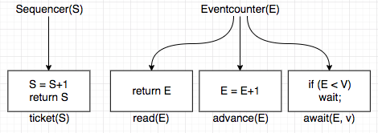
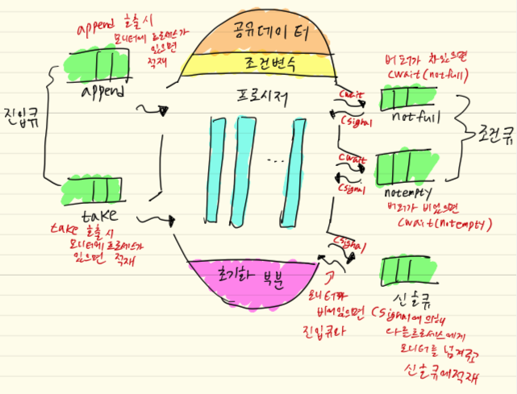
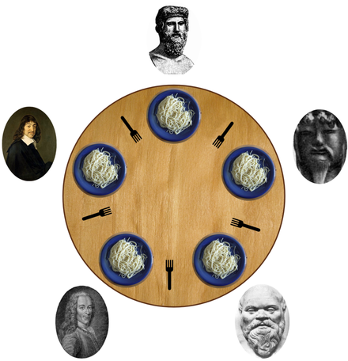

# 병행 프로세스와 동기화
- 비동기적이다
  - 병행 프로세스들이 서로간에 어떤 상태에 있는지, 어떤 자원을 가지고 있는지, 어디까지 실행됐는지 등에 대해
    모른체 실행되고 있음을 뜻함
- 비동기 상황에서 공유자원에 대한 접근이 제대로 처리되지 않으면 의도치 않은 결과가 발생할 수 있음

## Mutual Exclusion(상호배제, 뮤텍스)
- 프로세스들이 공유데이터에 대해 서로 접근을 시도하는 상황을 `Race Condition`이라 한다.
- 이러한 경쟁관계에 있는 프로세스들로 인해 상호배제, Dead Lock(교착상태), Starvation(기아상태) 같은 문제가 발생한다.
- 임계자원: 두 개 이상의 프로세스가 동시에 사용할 수 없는 자원
- 임계영역: 임계자원에 대해 접근하고 실행하는 프로그램내의 코드 부분
- 상호배제: 한번에 하나의 프로세스만이 임계영역에 들어가야 함
- 상호배제의 의무는 일반적으로 프로그래머에게 있으나 운영체제에서는 모니터와 같은 도구를 지원해줌

## 상호배제를 위한 소프트웨어 기법
- 소프트웨어 기법이란 병행하는 프로세스들에게 상호배제를 책임지도록 한 기법
- 이 기법들을 시도할 때 꼭 지켜져야할 것
  1. 상호배제가 지켜져야 함
  2. 임계영역에 있지 않은 프로세스가 다른 프로세스의 임계영역 진입을 막아서는 안됨
  3. 비어있는 임계 영역은 진입을 바로 허용하되, 특정 프로세스의 진입시도가 계속 무산되어 기아를 겪으면 안됨

### Peterson Algorithm
- 두 개의 프로세스만 상호배제를 할 수 있음
``` c
void p0() {
  while (true) {
    flag[0] = true;
    turn = 1;
    while (flag[1] && turn == 1); /* do nothing */
    <critical section>; /* 임계 영역을 뜻함 */
    flag[0] = false;
    <remainder>;
  }
}

void p1() {
  while (true) {
    flag[1] = true;
    turn = 0;
    while (flag[0] && turn == 0); /* do nothing */
    <critical section>; /* 임계 영역을 뜻함 */
    flag[1] = false;
    <remainder>;
  }
}

Begin /* main */
  int turn = 0;
  bool flag[2]; /* 초기값은 모두 false */
  parbegin /* 이 사이에 실행 되는 것은 처리기에 따라 다르게 실행되지만 병렬로 처리된다고 가정함 */
    p0();  /* 즉 P0와 P1은 동시에 실행되고 있음 */
    p1();
  parend
End
```

### Lamport - Bakery Algorithm
- n개의 프로세스에서 상호배제가 가능한 알고리즘
``` c
do {
  choosing[i] = true;
  number[i] = max(number[0], number[1],..., number[n-1]) + 1;
  choosing[i] = false;
  for (j = 0; j < n; j++) {
    while (choosing[j]) ;
    while ((number[j] != 0) && ((number[j], j) < (number[i], i)));
  }
  <critical section>;
  number[i] = 0;
  <remainder>;
} while (1);
```

### 소프트웨어 기법을 통한 상호배제의 단점
- 실행시 부하가 크다
- 프로그래머가 상호배제에대한 책임을 떠맡아야하므로 실수로인한 오류가 있을 수 있다.
- 임계영역의 중복 진입을 막기위해 while을 계속 도는데 CPU낭비다.(`Busy wait` 혹은 `Spin lock`이라고 부름)

## 상호배제를 위한 하드웨어 기법
### 인터럽트 금지를 사용한 기법
- 한 프로세스가 임계영역일때 CPU를 뺴앗기지 않도록 인터럽트를 발생시키지 않는다.
- 임계영역의 처리가 끝날때까지 모든 인터럽트를 금지하므로 시스템의 효율적인 운용이 불가능함
- 인터럽트는 처리기 단위라 단일이 아닌 다중처리 시스템에선 임계영역 중복진입을 못 막을 수도 있다.

### 하드웨어 명령어를 사용한 기법
- `testandset`을 이용한 기법
``` c
boolean testandset(boolean &target) { /* 프로시저 처럼 표현해 놨지만 사실은 원자성을 가진 기계명령어임 */
  boolean rv = target;
  target = true;
  return rv;
}

cont int n = ...; /* 프로세스 개수 */
boolean lock;
void P(int i) {
  while (true) {
    while (testandset(lock));
    <critical section>;
    lock = false;
    <remainder>;
  }
}
void main() {
  lock = false;
  parbegin
    P(1), P(2), ..., P(n);
  parend;
}
```
- `exchange` 혹은 `swap`을 이용한 기법
``` c
void exchange(boolean &r, boolean &m) { /* 프로시저 처럼 표현해 놨지만 사실은 원자성을 가진 기계명령어임 */
  boolean temp = r;
  r = m;
  m = temp;
}

cont int n = ...; /* 프로세스 개수 */
boolean lock;
void P(int i) {
  while (true) {
    key = true;
    while (key = true) do exchange(key, lock);
    <critical section>;
    lock = false;
    <remainder>;
  }
}
void main() {
  lock = false;
  parbegin
    P(1), P(2), ..., P(n);
  parend;
}
```

- 장점: 한 프로그램 내에서 서로다른 변수를 사용하여 여러개의 임계영역을 지원한다.
- 단점: Busy wait, 차례가 없어서 어떤 프로세스는 기아를 겪을 수 있다. Dead Lock 위험이 있음

## Semaphore(세마포어)
- Dijkstra가 1965년에 제안한 개념
- 세 개의 특수한 명령들만 접근할 수 있게 허용되는 변수
- Binary Semaphor, Integer Semaphore 등이 있다.
- Indivisible 명령: 초기화 명령, P 명령(wait, down), V 명령(signal, up)

```
// S는 세마포어 변수
P(S): if (S > 0) then S = S - 1;
                 else S > 0 조건이 만족될 때까지 큐에서 대기;
V(S): if (큐에서 대기중인 프로세스가 존재) then 그 중의 한 프로세스를 준비 또는 실행 상태로 만듦;
                                   else S = S + 1;
```
- 세마포어에 대한 명령들은 각각 분리되지 않고 수행될 수 있도록 구현한다.
- 같은 세마포어에 대해 동시에 실행되지 못한다.
- 세마포어를 활용하면 프로세스간의 동기화도 쉽게 구현이 가능하다.

## producer-consumer problem(생산자-소비자 문제)
- `생산자`는 데이터를 만들어 버퍼에 저장하고 `소비자`는 버퍼에 있는 데이터를 꺼내 소비하는 `프로세스`를 말한다.
- 버퍼
  - 공유자원을 의미
  - 접근(저장, 소비)이 상호배제 되어야 한다.
  - 버퍼가 꽉참 (생산자 대기), 버퍼 비어있음(소비자 대기) => 동기화
  - 세마포어를 이용한 기법은 운영체제 수준에서 임계 영역으로의 진입을 기다리는 프로세스들을 대기 상태로 전환
    시키므로써 CPU낭비를 줄일 수 있음
  - 단 프로세스를 대기 상태로 전환하는 비용이 발생하고, 임계영역이 짧을 경우 busy wait을 사용하는게 더 반응이
    빠르며, 대기중인 프로세스들의 다음 차례 선택에대한 기준이 없어서 기아를 유발할 수 있음
``` c
semaphore s = 1; /* */
semaphore f = 0;
semaphore e = n; /* buffer size */

void producer() {
  while (true) {
    produce data V;
    P(e);
    P(s);
    append data V;
    V(s);
    V(f);
  }
}

void consumer() {
  while (true) {
    p(f);
    p(s);
    take data W;
    V(s);
    V(e);
    consume data W;
  }
}

void main() {
  parbegin
    producer(), consumer();
  parend
}
```

## Eventcounter와 Sequencer를 사용한 기법
- Eventcounter, Sequencer도 특별한 명령들에 의해서만 접근이 가능한 변수들이다.
- 초기값은 0으로 그 값이 감소하지 않는다.
- 
- Sequencer에 대한 명령은 비분리로 이루어져야 하지만 나머지는 비분리로 이루어지지 않아도 좋다.
- 임계영역의 진입을 시도하는 프로세스들에게 순번표를 부여해 기아문제를 해결
- 은행으로치면 ticket(S)로 번호표를 뽑고 await(E,v)로 차례가 올때까지 대기, read(E)로 현재 번호를 확인하고,
  advance(E)로 은행원이 차례번호를 올린다.

## Monitor(모니터)
- 
- 모니터란 공유데이터들과 이들에 대한 임계영역들을 관리하는 소프트웨어 구성체이다.
- 모니터로의 진입은 프로시저의 호출로 가능하고, 한 번에 하나 이하의 프로세스만이 모니터 내에 있게 함으로써
  `상호배제`를 자연스럽게 실현한다.

## The Dining-Philosophers Problem (식사하는 철학자 문제)

- 상호배제나 동기화 그리고 기아와 교착 상태를 설명해주는 문제
```
5명의 철학자가 앉아있고, 식탁에는 5접시의 스파게티와 5개의 포크가 놓여있다.
철학자들은 비동기적으로 먹거나 생각하는 일을 반복하는데,
스파게티를 먹기 위해서는 자신의 오른쪽과 왼쪽에 있는 포크 두 개가 있어야 한다.
철학자들은 서로 대화하거나, 들고있는 포크를 빼앗을 수 없다.
```
- 결국 `포크`가 공유 자원이 되며, 철학자들의 정상적인 식사를 보장하는 것이 문제의 핵심

### 첫번째 해결법과 문제점
- 왼쪽 포크를 집은다음 오른쪽 포크를 집을 수 있게 하자
```
philosopher i:
while (true) {
  think;
  P(fork[i]); // 왼쪽 포크 집기
  P(fork[(i+1) % 5]); // 오른쪽 포크 집기
  eat;
  V(fork[i]); // 왼쪽 포크 내려놓기
  V(fork[(i+1) % 5]); // 오른쪽 포크 내려놓기
}
```
- 모든 철학자가 왼쪽 포크를 집고 오른쪽 포크를 기다리는 DeadLock에 걸릴 수 있음

### 두번째 해결법과 문제점
- 왼쪽 포크와 오른쪽 포크를 한번에 집을 수 있게 하자
```
philosopher i:
while (true) {
  think;
  P(fork[i] and fork[(i+1) % 5]);
  eat;
  V(fork[i] and fork[(i+1) % 5]);
}
```
- DeadLock은 발생하지 않지만 특정 철학자(쓰레드)가 기아 상태에 빠질 수 있음

### 완전한 해결법
1. 포크의 개수가 철학자의 수보다 많도록 세팅 (철학자의 수를 줄이거나..)
2. 홀수 번호의 철학자는 왼쪽 포크를 먼저 집고 짝수 번호의 철학자는 오른쪽 포크를 먼저 집는다.
